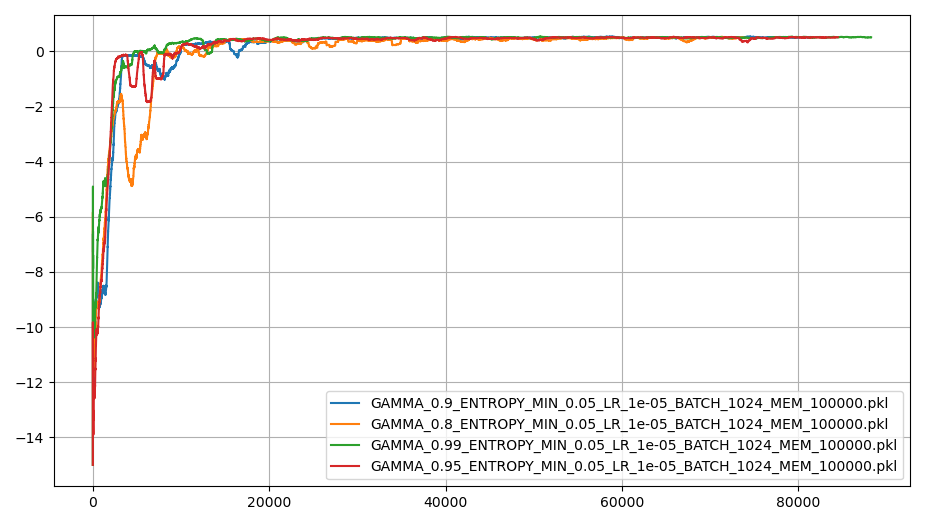
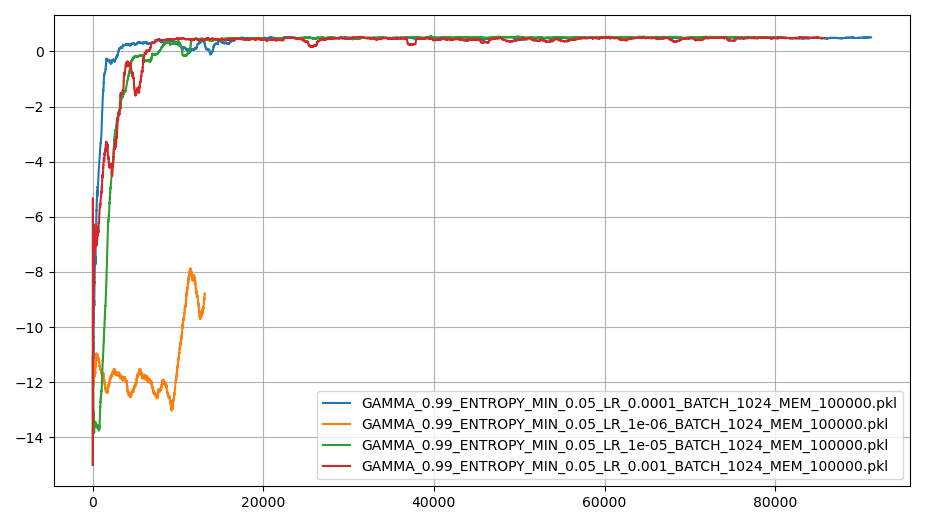
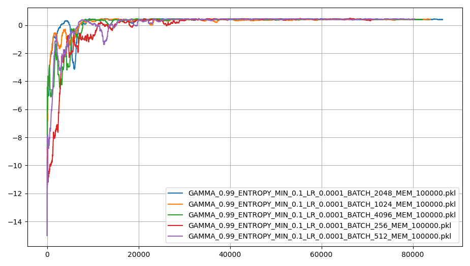
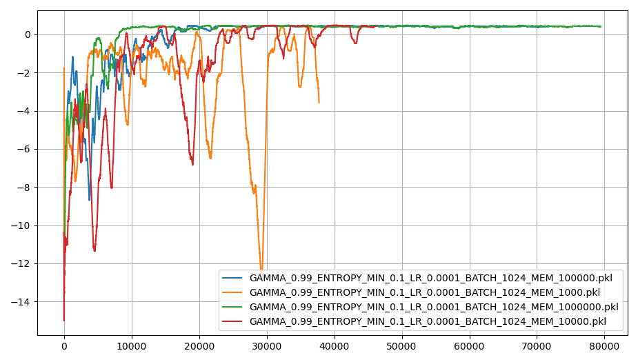
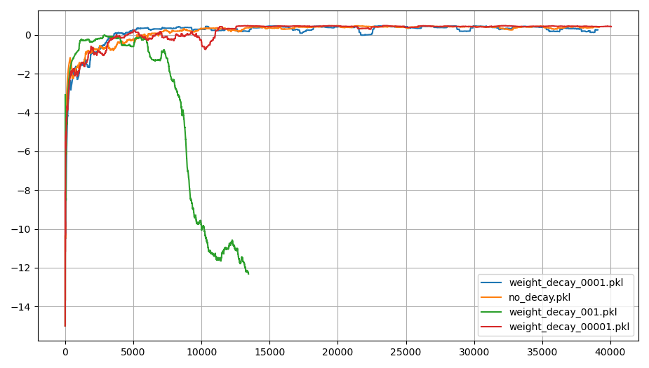
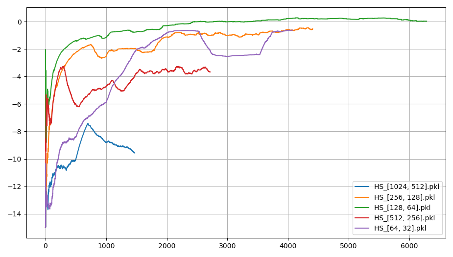
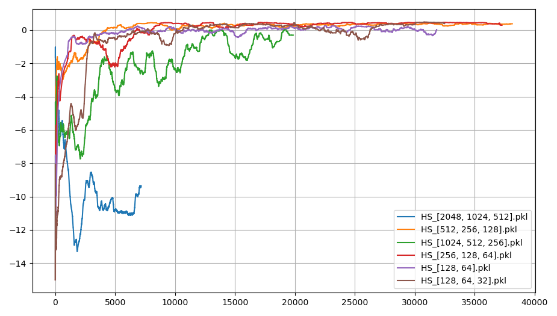
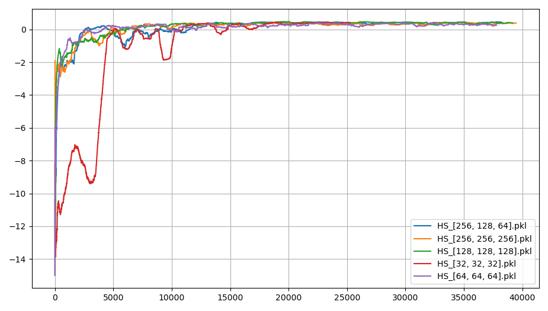

# Pathfinder Reinforcement Learning using Q-values
A simple discrete pathfinder using Q-learning for environemnt with a goal and a dangerous wall.

The algorithm learns how the actor should traverse the environment by prediction the values of each of the 4 discrete actions, up, down, left, and right.

When the actor reaches the goal it gets 1 point and if it moves into the dangerours wall it gets -1 point.

## Showcase of the trained actor

## Optimizations

### Gamma

Gamma is used as the discount-factor for future rewards. This is neseccary because the optimal trajectory is not guaranteed.

The differences were small but $0.95$ or $0.99$ seemed optimal.

### Learning Rate

The learning rate used to update the weights and biases between runs.

The learning rate had a large impact, $0.0001$ seemed optimal.

### Minimum entropy

The floor of the randomness used to select actions, applicable after the decay of the entropy has ran its course.

$5\%$ was too low but anything between $10-25\%$ was fine.

### Batch size

How many state-action-reward-next state-done tuples to train on at once.

This one is a bit missleading because a larger batchsize improves learning but it also takes significantly longer, meaning no conclusions can be taken from this graph.

### Replay memory size

How large the queue for previous experiences is.

As large as possible was optimal as long as you have the right hardware.

### L2 regularzation 

Penalizes large weights to prevent over fitting.

### Neural network hidden sizes

This simple environment only requires a shallow network, but tapering or uniform was still tested.

#### 2 hidden layers

2 tampering hidden layers.

2 hidden layers was not enough for this environment.

#### 3 hidden layers

3 tampering hidden layers.

3 hidden layers performed great, $256-128-54$ or $128-64-32$ was optimal.

#### Uniform hidden layers

Uniform hidden layers.

3 uniform layers perfomed equally well as 3 tampered layers.

