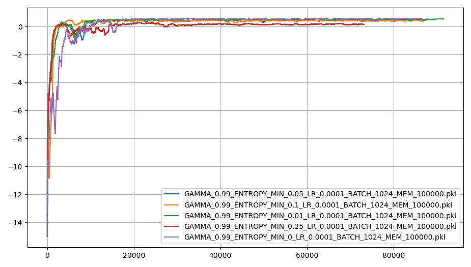

# Pathfinder Reinforcement Learning using Q-values
A simple discrete pathfinder using Q-learning for environemnt with a goal and a dangerous wall.

The algorithm learns how the actor should traverse the environment by prediction the values of each of the 4 discrete actions, up, down, left, and right.

When the actor reaches the goal it gets 1 point and if it moves into the dangerours wall it gets -1 point.

## Showcase of the trained actor

## Optimizations

### Gamma

### Learning Rate

### Minimum entropy

### Batch size

### Replay memory size

### L2 regularzation 

### Neural network hidden sizes

#### 2 hidden layers

#### 3 hidden layers

#### Uniform hidden layers

